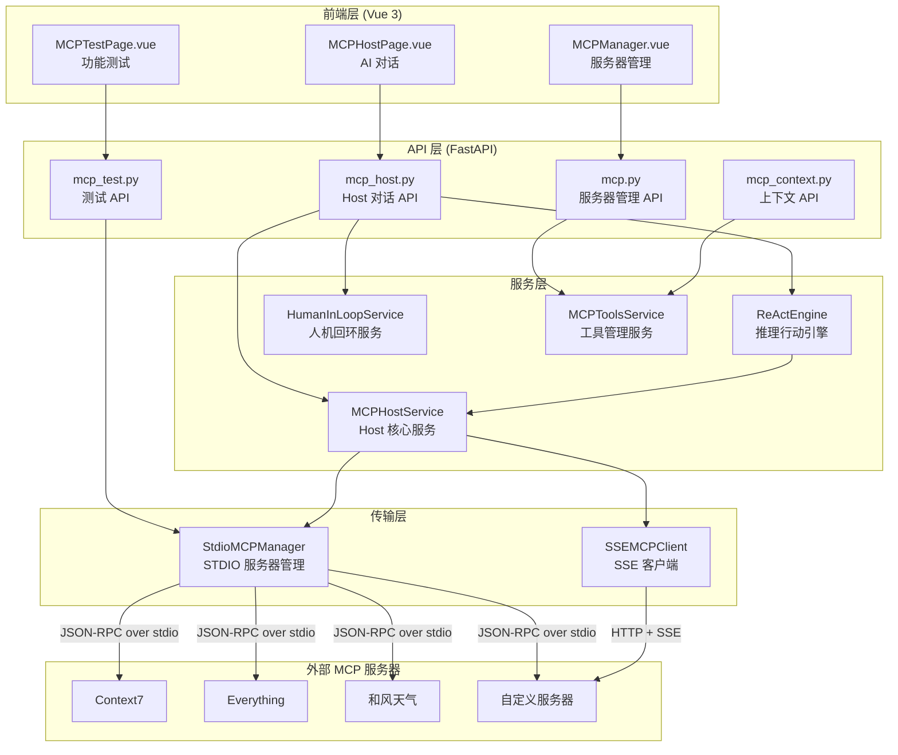
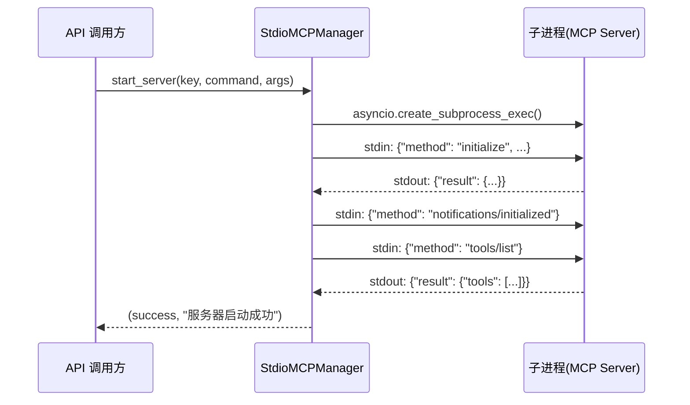
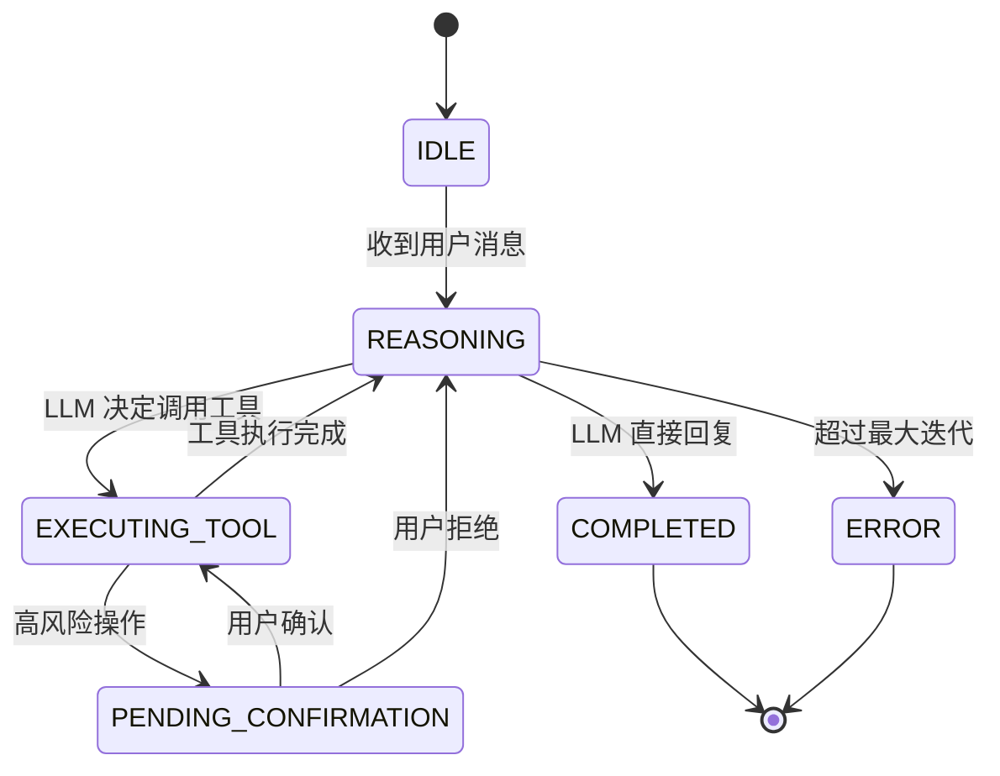
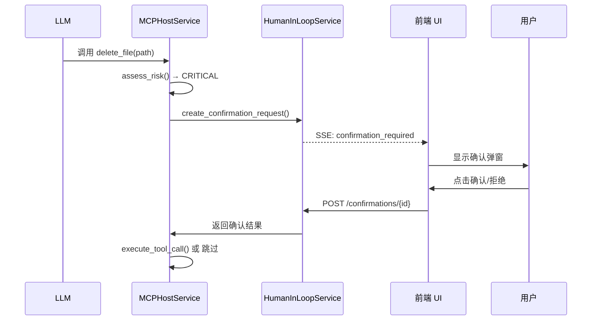
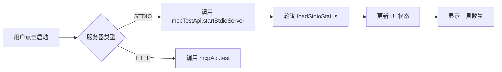

# MCP 功能技术分析文档

> **版本**: v1.0  
> **生成日期**: 2026-01-19  
> **文档类型**: 面向技术领导的产品技术文档  
> **适用范围**: UI Config 智能配置系统 MCP 功能模块

---

## 目录

1. [功能概述](#1-功能概述)
2. [架构设计](#2-架构设计)
3. [功能模块详解](#3-功能模块详解)
4. [关键实现细节](#4-关键实现细节)
5. [迁移指南](#5-迁移指南)
6. [总结与建议](#6-总结与建议)

---

## 1. 功能概述

### 1.1 MCP 功能的业务价值

MCP（Model Context Protocol）是 Anthropic 发布的开放标准协议，本项目实现了完整的 MCP Host 功能，使 AI 模型能够：

| 能力 | 业务价值 | 应用场景 |
|------|----------|----------|
| **工具调用** | 让 AI 执行实际操作而非仅生成文本 | 天气查询、文档搜索、API 调用 |
| **资源访问** | 动态获取外部数据作为上下文 | 读取配置、获取实时数据 |
| **人机回环** | 高风险操作需人工确认，保障安全 | 数据修改、支付操作 |
| **多服务器聚合** | 统一管理多个工具来源 | 组合多种 MCP 服务能力 |

### 1.2 当前实现的功能范围

```
✅ 已实现功能
├── MCP 服务器管理（预置 + 自定义）
├── STDIO 传输协议完整支持
├── SSE 传输协议框架（已实现，待业务场景接入）
├── ReAct 推理-行动循环引擎
├── 人机回环确认机制
├── 多 LLM 提供商支持（OpenAI/Anthropic/智谱/Ollama）
├── 工具风险评估与分级
├── 流式响应（SSE）
├── 审计日志
└── 前端管理界面

⚠️ 功能边界
├── 不支持 MCP Sampling 能力（服务端请求 LLM）
├── 不支持 MCP Roots 能力（工作区管理）
└── SSE 远程服务器尚无实际业务接入
```

### 1.3 预置 MCP 服务器

系统内置 4 个预置服务器，开箱即用：

| 服务器 | 标识 | 功能 | 依赖 |
|--------|------|------|------|
| Context7 | `context7` | 官方文档搜索 | Node.js |
| Everything | `everything` | 官方测试服务 | Node.js |
| 和风天气 | `hefeng` | 实时天气查询 | Node.js + API Key |
| Wttr 天气 | `wttr` | 免费天气查询 | Node.js |

---

## 2. 架构设计

### 2.1 整体架构图



### 2.2 核心模块划分及职责

| 模块 | 文件路径 | 核心职责 |
|------|----------|----------|
| **MCP 服务器管理 API** | `api/v1/mcp.py` | 服务器 CRUD、启用/禁用、配置上传 |
| **MCP Host API** | `api/v1/mcp_host.py` | 会话管理、对话交互、工具确认、服务器启停 |
| **MCP 测试 API** | `api/v1/mcp_test.py` | 工具测试、批量验证、Demo 服务器 |
| **MCP 上下文 API** | `api/v1/mcp_context.py` | 生成系统提示词、工具格式转换 |
| **STDIO 管理器** | `services/stdio_mcp_manager.py` | 子进程生命周期、JSON-RPC 通信 |
| **SSE 客户端** | `services/sse_mcp_client.py` | HTTP 连接、SSE 事件流解析 |
| **Host 核心服务** | `services/mcp_host_service.py` | 工具聚合、风险评估、调用执行 |
| **ReAct 引擎** | `services/react_engine.py` | LLM 调用、工具解析、循环控制 |
| **人机回环服务** | `services/human_in_loop.py` | 确认请求管理、超时处理、审计日志 |
| **工具服务** | `services/mcp_tools_service.py` | 工具信息聚合、格式转换 |
| **数据模型** | `models/mcp_server.py` | SQLAlchemy 模型定义 |

### 2.3 技术栈和关键依赖

#### 后端技术栈

| 技术 | 版本/说明 | 用途 |
|------|-----------|------|
| **Python** | 3.9+ | 运行时 |
| **FastAPI** | 异步 Web 框架 | API 服务 |
| **SQLAlchemy** | 异步 ORM | 数据库操作 |
| **httpx** | 异步 HTTP 客户端 | LLM API 调用、SSE 连接 |
| **asyncio** | 标准库 | 子进程管理、并发控制 |
| **Pydantic** | 数据验证 | 请求/响应模型 |

#### 前端技术栈

| 技术 | 用途 |
|------|------|
| **Vue 3** | UI 框架 |
| **Ant Design Vue** | 组件库 |
| **Vite** | 构建工具 |
| **axios** | HTTP 请求 |

#### MCP 协议依赖

```
MCP Protocol Version: 2024-11-05
JSON-RPC Version: 2.0
传输协议: STDIO / SSE (HTTP+EventSource)
```

---

## 3. 功能模块详解

### 3.1 STDIO MCP 管理器

#### 功能描述

管理通过标准输入输出（stdin/stdout）与后端通信的本地 MCP 服务器进程。这是最常用的传输方式，适用于 `npx` 启动的 Node.js MCP 服务器。

#### 实现方式

**关键代码路径**: `backend/app/services/stdio_mcp_manager.py`

```python
# 核心数据结构
@dataclass
class MCPSession:
    server_key: str                          # 服务器唯一标识
    process: asyncio.subprocess.Process      # 子进程句柄
    request_id: int = 0                      # JSON-RPC 请求 ID 计数器
    initialized: bool = False                # 是否完成初始化
    tools: List[Dict] = field(default_factory=list)      # 工具列表
    resources: List[Dict] = field(default_factory=list)  # 资源列表
    prompts: List[Dict] = field(default_factory=list)    # 提示模板列表
```

**启动流程**:



#### 核心技术点

1. **JSON-RPC 2.0 协议实现**
   - 请求格式: `{"jsonrpc": "2.0", "id": N, "method": "...", "params": {...}}`
   - 通知格式: `{"jsonrpc": "2.0", "method": "...", "params": {...}}` (无 id)
   - 响应解析: 支持 result/error 两种响应

2. **非 JSON 输出容错**
   - 部分 MCP 服务器会在 stdout 输出日志
   - 实现了跳过非 JSON 行的逻辑

3. **进程生命周期管理**
   - 启动时设置超时（默认 30 秒，npx 下载可能需要 60 秒）
   - 停止时先 terminate，超时后 kill
   - 自动检测进程退出状态

```python
# 关键实现：非 JSON 输出容错
async def _send_request(self, session, method, params):
    # ...发送请求...
    while True:
        response_line = await session.process.stdout.readline()
        try:
            response = json.loads(response_line.decode())
            break  # 成功解析 JSON
        except json.JSONDecodeError:
            # 跳过非 JSON 输出（如服务器日志）
            logger.warning("Non-JSON output: %s", response_line)
            continue
```

#### 与其他模块的交互

```
┌─────────────────┐      ┌─────────────────┐
│ MCPHostService  │─────▶│ StdioMCPManager │
└─────────────────┘      └────────┬────────┘
         │                        │
         │                        ▼
         │               ┌─────────────────┐
         │               │  MCP 子进程     │
         │               │  (npx, node)    │
         │               └─────────────────┘
         │
         ▼
┌─────────────────┐
│ MCPToolsService │ ◀── 聚合工具信息
└─────────────────┘
```

---

### 3.2 ReAct 推理引擎

#### 功能描述

实现 ReAct（Reasoning and Acting）循环，让 LLM 能够通过"思考-行动-观察"的循环完成复杂任务。

#### 实现方式

**关键代码路径**: `backend/app/services/react_engine.py`

**ReAct 循环状态机**:



**核心流程**:

```python
async def run_react_loop(session_id, user_input, llm_config):
    # 1. 准备上下文
    context = get_context(session_id)
    context.messages.append({"role": "user", "content": user_input})
    context.tools = await mcp_host_service.get_aggregated_tools()
    
    while iteration < max_iterations:
        # 2. 调用 LLM
        llm_response = await call_llm(context.messages, context.tools, llm_config)
        
        # 3. 检查是否有工具调用
        tool_calls = parse_tool_calls(llm_response)
        
        if not tool_calls:
            # 没有工具调用，返回最终回复
            yield {"type": "final", "content": llm_response.content}
            break
        
        # 4. 执行工具调用
        for call in tool_calls:
            request = await mcp_host_service.prepare_tool_call(
                session_id, call["name"], call["arguments"]
            )
            
            if request.requires_confirmation:
                # 高风险操作，等待确认
                yield {"type": "confirmation_required", ...}
                return  # 暂停循环，等待确认
            
            # 执行工具
            result = await mcp_host_service.execute_tool_call(request)
            
            # 将结果加入上下文
            context.messages.append({
                "role": "tool",
                "tool_call_id": call["id"],
                "content": json.dumps(result.result)
            })
```

#### 核心技术点

1. **多 LLM 提供商适配**
   - 统一的 `call_llm` 接口
   - 支持 OpenAI、Anthropic、智谱、Ollama 四种格式
   - 自动处理工具调用格式差异

2. **流式事件输出**
   - 使用 AsyncGenerator 实现流式响应
   - 事件类型: state/tool_call/tool_result/confirmation_required/final/error

3. **工具调用解析**
   - 支持 OpenAI function calling 格式
   - 支持 Anthropic tool_use 格式
   - 统一转换为内部格式

```python
# 工具名称命名空间设计
# 格式: {server_key}__{tool_name}
# 示例: hefeng__get_weather, context7__get-library-docs
# 好处: 避免不同服务器工具名冲突
```

---

### 3.3 人机回环服务

#### 功能描述

为高风险工具调用提供人工确认机制，防止 AI 误操作。实现了完整的确认请求生命周期管理。

#### 实现方式

**关键代码路径**: `backend/app/services/human_in_loop.py`

**风险等级定义**:

```python
class ToolRiskLevel(Enum):
    LOW = "low"           # 只读操作，无需确认
    MEDIUM = "medium"     # 可能访问敏感数据，建议确认
    HIGH = "high"         # 会修改数据，必须确认
    CRITICAL = "critical" # 危险操作，需要二次确认
```

**风险评估逻辑**:

```python
# 基于关键词的风险评估
HIGH_RISK_KEYWORDS = {
    ToolRiskLevel.CRITICAL: [
        "delete", "remove", "drop", "truncate", "destroy",
        "execute", "exec", "run", "eval", "shell", "command",
        "transfer", "payment", "transaction"
    ],
    ToolRiskLevel.HIGH: [
        "write", "update", "modify", "create", "insert",
        "edit", "patch", "put", "post", "upload"
    ],
    ToolRiskLevel.MEDIUM: [
        "list", "search", "query", "fetch", "download"
    ]
}
```

**确认请求流程**:



#### 核心技术点

1. **超时自动拒绝**
   - 默认 5 分钟超时
   - 后台定时任务清理过期请求

2. **参数修改能力**
   - 允许用户在确认前修改工具参数
   - 适用于 AI 参数不准确的情况

3. **审计日志**
   - 记录所有确认/拒绝操作
   - 支持按会话和时间查询

```python
# 确认请求数据结构
@dataclass
class ConfirmationRequest:
    id: str
    session_id: str
    tool_call: ToolCallRequest
    risk_level: ToolRiskLevel
    status: ConfirmationStatus  # pending/approved/rejected/expired
    risk_description: str       # 风险描述
    warning_message: str        # 警告信息
    expires_at: datetime        # 过期时间
    modified_arguments: Dict    # 用户修改后的参数
```

---

### 3.4 SSE MCP 客户端

#### 功能描述

支持通过 HTTP + Server-Sent Events 连接远程 MCP 服务器。适用于跨网络部署的场景。

#### 实现方式

**关键代码路径**: `backend/app/services/sse_mcp_client.py`

**通信模型**:

```
┌─────────────┐                    ┌─────────────┐
│  SSE Client │                    │ Remote MCP  │
│   (本系统)  │                    │   Server    │
├─────────────┤                    ├─────────────┤
│ GET /sse    │──── 建立连接 ─────▶│             │
│             │◀── SSE 事件流 ─────│             │
│             │                    │             │
│ POST /msg   │──── JSON-RPC ─────▶│             │
│             │◀── (通过 SSE) ─────│             │
└─────────────┘                    └─────────────┘
```

**连接状态机**:

```python
class SSEConnectionState(Enum):
    DISCONNECTED = "disconnected"  # 未连接
    CONNECTING = "connecting"      # 连接中
    CONNECTED = "connected"        # 已连接
    RECONNECTING = "reconnecting"  # 重连中
    ERROR = "error"                # 错误
```

#### 核心技术点

1. **SSE 流解析**
   - 标准 SSE 格式: `event:`, `data:`, `id:`, `retry:`
   - 支持多行 data

2. **请求-响应匹配**
   - POST 发送请求，响应通过 SSE 返回
   - 使用 `request_id` + `asyncio.Future` 匹配

3. **自动重连**
   - 连接断开后自动重连
   - 重连延迟递增

---

### 3.5 MCP 工具服务

#### 功能描述

聚合所有已启用 MCP 服务器的工具信息，提供多种格式输出。

#### 实现方式

**关键代码路径**: `backend/app/services/mcp_tools_service.py`

**输出格式**:

| 格式 | 用途 | 示例 |
|------|------|------|
| 系统提示词 | 注入到 AI 系统提示 | Markdown 格式的工具说明 |
| OpenAI tools | OpenAI API 调用 | `{"type": "function", "function": {...}}` |
| Anthropic tools | Claude API 调用 | `{"name": "...", "input_schema": {...}}` |
| 原始列表 | 前端展示 | 工具详情数组 |

**工具命名空间**:

```python
# 避免不同服务器工具名冲突
# 格式: {server_key}__{tool_name}

def format_for_api_tools(tools):
    return [{
        "type": "function",
        "function": {
            "name": f"{tool.server_key}__{tool.name}",  # 命名空间
            "description": f"[{tool.server_name}] {tool.description}",
            "parameters": tool.input_schema
        }
    } for tool in tools]
```

---

### 3.6 MCP 服务器管理 API

#### 功能描述

提供 MCP 服务器的 CRUD 操作，支持预置服务器和自定义服务器。

#### 实现方式

**关键代码路径**: `backend/app/api/v1/mcp.py`

**预置服务器配置**:

```python
PRESET_MCP_SERVERS = {
    "context7": {
        "name": "Context7",
        "description": "官方文档搜索 MCP 服务器",
        "transport": "stdio",
        "command": "npx",
        "args": ["-y", "@upstash/context7-mcp@latest"],
        "tools": ["resolve-library-id", "get-library-docs"],
        "is_preset": True,
        "requires_node": True
    },
    # ... 其他预置服务器
}
```

**数据模型**:

```python
class MCPServer(Base):
    __tablename__ = "mcp_servers"
    
    id = Column(Integer, primary_key=True)
    preset_key = Column(String(50), unique=True)  # 预置服务器标识
    name = Column(String(100), nullable=False)
    transport = Column(String(20), default="http")  # http/stdio
    
    # HTTP 字段
    server_url = Column(String(500))
    health_check_path = Column(String(100), default="/health")
    
    # STDIO 字段
    command = Column(String(200))   # npx, node, python
    args = Column(JSON, default=[])  # ["-y", "package@latest"]
    env = Column(JSON, default={})   # {"API_KEY": "xxx"}
    
    # 通用字段
    tools = Column(JSON, default=[])
    status = Column(String(20), default="disabled")  # enabled/disabled/error
    auth_type = Column(String(20), default="none")   # none/api_key/oauth
    auth_config = Column(JSON)
```

---

### 3.7 前端组件

#### MCPManager.vue - 服务器管理页面

**功能**:
- 预置服务器列表展示
- 自定义服务器 CRUD
- 服务器启动/停止
- 工具测试面板
- MCP 上下文查看

**核心交互**:



#### MCPHostPage.vue - AI 对话页面

**功能**:
- 服务器连接状态显示
- 安全策略展示
- 系统健康状态
- 审计日志查看
- ChatPanel 对话组件

**核心交互**:

```mermaid
flowchart TB
    A[用户发送消息] --> B[ChatPanel 组件]
    B --> C[POST /sessions/{id}/chat]
    C --> D{事件类型}
    D -->|tool_call| E[显示工具调用]
    D -->|confirmation_required| F[弹出确认框]
    D -->|final| G[显示 AI 回复]
    F --> H{用户选择}
    H -->|确认| I[POST /confirmations/{id}]
    H -->|拒绝| J[继续对话]
```

---

## 4. 关键实现细节

### 4.1 MCP 协议对接方式

#### 客户端角色

本系统作为 **MCP Client/Host**，连接外部 **MCP Server**。

```
┌──────────────────────────────────────────────────────┐
│                    本系统 (Host)                      │
│  ┌─────────────┐  ┌─────────────┐  ┌─────────────┐  │
│  │   前端 UI   │  │  后端 API   │  │ MCP Client  │  │
│  └─────────────┘  └─────────────┘  └──────┬──────┘  │
│                                           │         │
└───────────────────────────────────────────┼─────────┘
                                            │
                    ┌───────────────────────┼───────────────────────┐
                    │                       ▼                       │
                    │  ┌─────────────────────────────────────────┐ │
                    │  │           MCP Server (外部)              │ │
                    │  │  - Context7 (npx @upstash/context7-mcp) │ │
                    │  │  - 和风天气 (npx hefeng-mcp-server)      │ │
                    │  │  - 自定义服务器                          │ │
                    │  └─────────────────────────────────────────┘ │
                    └─────────────────────────────────────────────┘
```

#### 协议版本

```python
# 初始化请求中声明的协议版本
"protocolVersion": "2024-11-05"
```

#### 支持的 MCP 能力

| 能力 | 支持状态 | 说明 |
|------|----------|------|
| Tools | ✅ 完整支持 | 工具发现、调用、结果处理 |
| Resources | ✅ 支持 | 资源列表、读取 |
| Prompts | ✅ 支持 | 提示模板列表、获取 |
| Sampling | ❌ 未支持 | 服务端请求 LLM |
| Roots | ❌ 未支持 | 工作区管理 |

### 4.2 消息传输机制和数据格式

#### STDIO 传输

```
后端进程 ◀──────────▶ MCP Server 子进程
           stdin      (npx/node)
           stdout
           stderr (忽略)
```

**消息格式**: 每行一个 JSON 对象，以 `\n` 分隔

```json
// 请求
{"jsonrpc":"2.0","id":1,"method":"tools/call","params":{"name":"get_weather","arguments":{"city":"北京"}}}

// 响应
{"jsonrpc":"2.0","id":1,"result":{"content":[{"type":"text","text":"天气: 晴, 温度: 3°C"}]}}

// 错误响应
{"jsonrpc":"2.0","id":1,"error":{"code":-32602,"message":"Invalid params"}}
```

#### SSE 传输

```
后端 ──── GET /sse ────▶ 远程服务器
     ◀── SSE 事件流 ────
     ──── POST /msg ───▶
```

**SSE 事件格式**:

```
event: message
data: {"jsonrpc":"2.0","id":1,"result":{...}}

event: notification
data: {"jsonrpc":"2.0","method":"notifications/tools/list_changed"}
```

### 4.3 错误处理和异常恢复机制

#### 服务器启动失败处理

```python
async def start_server(server_key, command, args, timeout=30.0):
    try:
        # 1. 检查命令是否存在
        if command == "npx" and not shutil.which("npx"):
            return False, "未找到 npx 命令，请确保已安装 Node.js"
        
        # 2. 启动进程
        process = await asyncio.create_subprocess_exec(...)
        
        # 3. 初始化超时处理
        try:
            await asyncio.wait_for(self._initialize(session), timeout=timeout)
        except asyncio.TimeoutError:
            await self.stop_server(server_key)
            return False, f"服务器初始化超时 ({timeout}秒)"
        
    except FileNotFoundError:
        return False, f"命令 {command} 未找到"
    except Exception as e:
        return False, f"启动服务器失败: {str(e)}"
```

#### 工具调用错误处理

```python
async def execute_tool_call(request, force=False):
    try:
        # 1. 检查服务器是否运行
        if not stdio_mcp_manager.is_running(request.server_key):
            return ToolCallResult(
                success=False,
                error=f"MCP 服务器 {request.server_key} 未运行"
            )
        
        # 2. 调用工具
        result = await stdio_mcp_manager.call_tool(...)
        return ToolCallResult(success=True, result=result)
        
    except Exception as e:
        logger.error(f"Tool call failed: {e}")
        return ToolCallResult(success=False, error=str(e))
```

#### SSE 连接断开重连

```python
async def _sse_listener(session):
    while True:
        try:
            async with client.stream("GET", url) as response:
                session.state = SSEConnectionState.CONNECTED
                async for message in parse_sse_stream(response):
                    await handle_message(session, message)
                    
        except httpx.ReadTimeout:
            session.state = SSEConnectionState.RECONNECTING
            await asyncio.sleep(1)  # 重连延迟
            continue
            
        except asyncio.CancelledError:
            break
            
        except Exception as e:
            session.state = SSEConnectionState.ERROR
            await asyncio.sleep(5)  # 错误后等待更长时间
            session.state = SSEConnectionState.RECONNECTING
```

### 4.4 性能优化措施

#### 1. 工具信息缓存

```python
@dataclass
class MCPSession:
    # 工具列表在初始化时获取并缓存
    tools: List[Dict] = field(default_factory=list)
    resources: List[Dict] = field(default_factory=list)
    prompts: List[Dict] = field(default_factory=list)
```

#### 2. 连接复用

- STDIO: 单个服务器维持一个长期运行的子进程
- SSE: 使用 `httpx.AsyncClient` 单例，复用 HTTP 连接

#### 3. 异步并发

- 所有 I/O 操作都使用 `async/await`
- 支持同时连接多个 MCP 服务器
- ReAct 循环支持流式响应，不阻塞

#### 4. 工具聚合延迟加载

```python
async def get_aggregated_tools(self):
    tools = []
    # 只遍历运行中的服务器
    for server_key, session in stdio_mcp_manager.sessions.items():
        if session.initialized and session.process.returncode is None:
            # 使用缓存的工具列表
            for tool in session.tools:
                tools.append(...)
    return tools
```

---

## 5. 迁移指南

### 5.1 迁移前置条件和环境要求

#### 系统要求

| 要求 | 最低版本 | 推荐版本 |
|------|----------|----------|
| Python | 3.9 | 3.11+ |
| Node.js | 18.0 | 20.0+ |
| npm/npx | 8.0 | 10.0+ |

#### 依赖检查

```bash
# 检查 Python 版本
python --version  # >= 3.9

# 检查 Node.js（MCP 服务器需要）
node --version    # >= 18.0
npx --version     # >= 8.0

# 检查数据库
# SQLite（当前使用）或 PostgreSQL
```

#### 网络要求

- npm 仓库访问（下载 MCP 服务器包）
- 和风天气 API（如使用天气功能）
- LLM API 访问（OpenAI/Anthropic/智谱等）

### 5.2 核心代码迁移步骤

#### 阶段一：基础设施（1-2 人天）

**目标**: 迁移数据模型和基础服务

1. **数据库迁移**

```python
# 复制 backend/app/models/mcp_server.py
# 创建数据库表
# 如果使用其他数据库，需要调整 SQLAlchemy 配置
```

2. **安装依赖**

```bash
# 后端依赖
pip install fastapi uvicorn httpx sqlalchemy aiosqlite pydantic

# 关键依赖版本
fastapi>=0.100.0
httpx>=0.24.0
sqlalchemy>=2.0.0
```

#### 阶段二：服务层迁移（2-3 人天）

**目标**: 迁移核心服务实现

1. **STDIO 管理器**
   - 文件: `services/stdio_mcp_manager.py`
   - 依赖: asyncio, json
   - 注意: 子进程管理在 Windows 和 Linux/macOS 略有差异

2. **Host 核心服务**
   - 文件: `services/mcp_host_service.py`
   - 依赖: stdio_mcp_manager, mcp_tools_service

3. **ReAct 引擎**
   - 文件: `services/react_engine.py`
   - 依赖: mcp_host_service, httpx
   - 注意: LLM API 调用需要配置

4. **人机回环服务**
   - 文件: `services/human_in_loop.py`
   - 依赖: asyncio

**迁移顺序**:

```
1. stdio_mcp_manager.py   ──────────────────────┐
                                                │
2. mcp_tools_service.py   ──────────────────────┼──▶ 阶段二
                                                │
3. mcp_host_service.py    ──────────────────────┤
                                                │
4. human_in_loop.py       ──────────────────────┤
                                                │
5. react_engine.py        ──────────────────────┘
```

#### 阶段三：API 层迁移（1-2 人天）

**目标**: 迁移 FastAPI 路由

1. **MCP 管理 API**
   - 文件: `api/v1/mcp.py`
   - 端点: `/api/v1/mcp/*`

2. **MCP Host API**
   - 文件: `api/v1/mcp_host.py`
   - 端点: `/api/v1/host/*`
   - 注意: 流式响应（SSE）需要特殊处理

3. **MCP 测试 API**
   - 文件: `api/v1/mcp_test.py`
   - 端点: `/api/v1/mcp-test/*`

4. **MCP 上下文 API**
   - 文件: `api/v1/mcp_context.py`
   - 端点: `/api/v1/mcp-context/*`

#### 阶段四：前端迁移（2-3 人天）

**目标**: 迁移 Vue 组件和 API 调用

1. **API 封装**
   - 文件: `frontend/src/api/index.js`
   - 包含: mcpApi, mcpTestApi, mcpHostApi, mcpContextApi

2. **服务器管理页面**
   - 文件: `frontend/src/views/MCPManager.vue`
   - 约 2400 行代码

3. **Host 对话页面**
   - 文件: `frontend/src/views/MCPHostPage.vue`
   - 文件: `frontend/src/components/MCPHost/ChatPanel.vue`
   - 文件: `frontend/src/components/MCPHost/ConfirmationModal.vue`

### 5.3 依赖项和配置项迁移清单

#### Python 依赖

```txt
# requirements.txt 中的 MCP 相关依赖
fastapi>=0.100.0
uvicorn>=0.22.0
httpx>=0.24.0
sqlalchemy>=2.0.0
aiosqlite>=0.19.0
pydantic>=2.0.0
```

#### 环境变量配置

```env
# API.env
ZHIPU_API_KEY=xxx           # 智谱 API Key（ReAct 引擎使用）
ZHIPU_MODEL_NAME=glm-4      # 默认模型
HEFENG_API_KEY=xxx          # 和风天气 API Key
HEFENG_API_URL=https://xxx  # 和风天气 API URL
```

#### 预置服务器配置

如需修改预置服务器，编辑 `backend/app/api/v1/mcp.py` 中的 `PRESET_MCP_SERVERS` 字典。

### 5.4 潜在风险点和注意事项

| 风险 | 影响 | 缓解措施 |
|------|------|----------|
| **Node.js 版本不兼容** | MCP 服务器启动失败 | 确保 Node.js >= 18 |
| **网络访问限制** | npm 包下载失败 | 配置 npm 镜像或离线安装 |
| **子进程管理差异** | Windows 行为不一致 | 测试 Windows 环境 |
| **LLM API 调用** | ReAct 循环失败 | 配置正确的 API Key |
| **数据库迁移** | 数据丢失 | 备份现有数据 |
| **SSE 流式响应** | 代理服务器缓冲 | 配置 `X-Accel-Buffering: no` |

### 5.5 迁移工作量评估

| 阶段 | 工作内容 | 人天 |
|------|----------|------|
| 阶段一 | 基础设施 | 1-2 |
| 阶段二 | 服务层 | 2-3 |
| 阶段三 | API 层 | 1-2 |
| 阶段四 | 前端 | 2-3 |
| 测试调试 | 集成测试 | 1-2 |
| **总计** | | **7-12 人天** |

**建议团队配置**:
- 1 名后端开发（Python/FastAPI）
- 1 名前端开发（Vue 3）
- 周期: 1-2 周

---

## 6. 总结与建议

### 6.1 当前实现的优势

| 优势 | 说明 |
|------|------|
| **协议标准化** | 遵循 MCP 开放标准，兼容生态内所有服务 |
| **架构清晰** | 分层设计，职责明确，易于维护 |
| **安全可控** | 完整的风险评估和人机回环机制 |
| **多 LLM 支持** | 支持 OpenAI/Anthropic/智谱/Ollama |
| **开箱即用** | 4 个预置服务器，无需额外配置 |
| **流式响应** | 实时展示推理过程和工具调用 |
| **完整文档** | 详细的 API 文档和使用指南 |

### 6.2 当前实现的不足

| 不足 | 影响 | 改进建议 |
|------|------|----------|
| **SSE 服务器未实际接入** | 远程 MCP 服务器场景未验证 | 接入实际业务场景测试 |
| **风险评估基于关键词** | 可能误判或漏判 | 引入更智能的风险评估模型 |
| **工具结果缓存缺失** | 重复调用相同参数 | 添加短期缓存机制 |
| **错误重试机制简单** | 网络波动可能导致失败 | 实现指数退避重试 |
| **监控指标不足** | 难以分析性能瓶颈 | 添加 Prometheus 指标 |
| **测试覆盖率** | 部分边界情况未覆盖 | 补充单元测试和集成测试 |

### 6.3 后续优化方向建议

#### 短期优化（1-2 周）

1. **添加工具调用缓存**
   - 相同参数的只读工具调用可缓存
   - 减少重复 API 调用

2. **完善错误重试**
   - 网络错误自动重试
   - 指数退避策略

3. **补充测试用例**
   - 工具调用边界情况
   - 人机回环超时处理

#### 中期优化（1-2 月）

1. **智能风险评估**
   - 基于工具 Schema 分析
   - 参数内容分析（如检测 SQL 注入风险）

2. **监控和告警**
   - 工具调用成功率
   - 响应时间分布
   - 服务器健康状态

3. **工具调用日志分析**
   - 统计热门工具
   - 分析失败原因

#### 长期规划（3-6 月）

1. **MCP Server 开发能力**
   - 提供工具开发框架
   - 支持自定义 Python MCP 服务器

2. **工具编排能力**
   - 支持工具组合（Pipeline）
   - 条件分支和循环

3. **多租户支持**
   - 服务器隔离
   - 权限管理

---

## 附录

### A. 文件清单

```
backend/app/
├── api/v1/
│   ├── mcp.py              # 557 行
│   ├── mcp_host.py         # 574 行
│   ├── mcp_test.py         # 879 行
│   └── mcp_context.py      # 181 行
├── services/
│   ├── stdio_mcp_manager.py    # 354 行
│   ├── sse_mcp_client.py       # 561 行
│   ├── mcp_host_service.py     # 399 行
│   ├── react_engine.py         # 706 行
│   ├── human_in_loop.py        # 382 行
│   ├── mcp_tools_service.py    # 376 行
│   └── mcp_client_service.py   # 763 行
├── models/
│   └── mcp_server.py       # 104 行
└── 总计                     # ~5,836 行

frontend/src/
├── views/
│   ├── MCPManager.vue      # 2,414 行
│   └── MCPHostPage.vue     # 601 行
├── components/MCPHost/
│   ├── ChatPanel.vue
│   └── ConfirmationModal.vue
└── api/index.js            # MCP API 封装
```

### B. API 端点汇总

| 模块 | 端点 | 方法 | 说明 |
|------|------|------|------|
| MCP 管理 | `/api/v1/mcp` | GET | 获取服务器列表 |
| | `/api/v1/mcp/{key}/toggle` | POST | 启用/禁用 |
| | `/api/v1/mcp/config` | POST | 添加服务器 |
| | `/api/v1/mcp/{id}` | PUT | 更新服务器 |
| | `/api/v1/mcp/{id}` | DELETE | 删除服务器 |
| Host | `/api/v1/host/sessions` | POST | 创建会话 |
| | `/api/v1/host/sessions/{id}/chat` | POST | 发送消息 |
| | `/api/v1/host/sessions/{id}/confirmations/{rid}` | POST | 确认工具 |
| | `/api/v1/host/servers` | GET | 服务器状态 |
| | `/api/v1/host/servers/stdio/{key}/start` | POST | 启动服务器 |
| | `/api/v1/host/servers/stdio/{key}/stop` | POST | 停止服务器 |
| | `/api/v1/host/tools` | GET | 聚合工具列表 |
| 测试 | `/api/v1/mcp-test/stdio/status` | GET | STDIO 状态 |
| | `/api/v1/mcp-test/stdio/start` | POST | 启动测试服务器 |
| | `/api/v1/mcp-test/stdio/tools/call` | POST | 调用工具 |
| 上下文 | `/api/v1/mcp-context` | GET | 完整上下文 |
| | `/api/v1/mcp-context/system-prompt` | GET | 系统提示词 |
| | `/api/v1/mcp-context/tools` | GET | 工具列表 |

---

> **文档维护**: 如有更新，请同步修改本文档  
> **问题反馈**: 请联系技术团队
